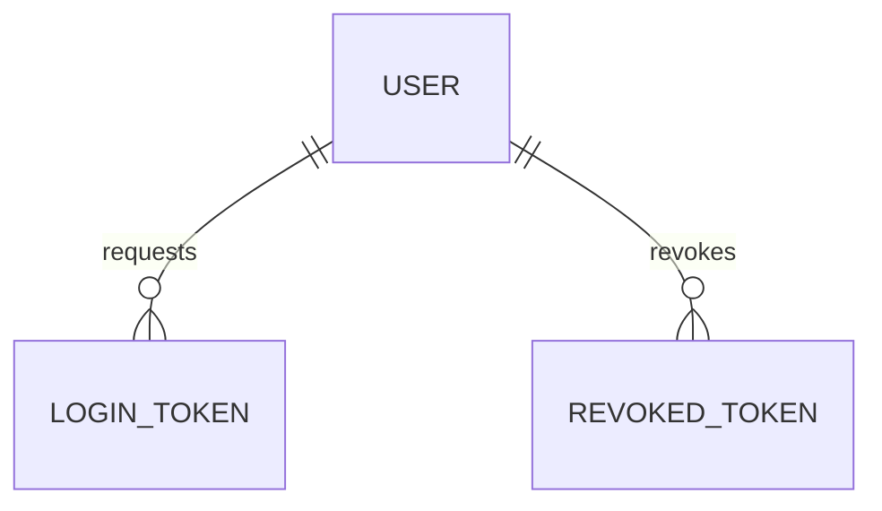

# u-club

Monorepo for the u-club project.

## Local URLs

- **PWA**: http://localhost:5173
- **API**: http://localhost:4000
- **API docs** (Swagger): http://localhost:4000/api-docs
- **Mailpit** (email inbox): http://localhost:8025

## Prerequisites

- [Node.js](https://nodejs.org/) >= 22
- [pnpm](https://pnpm.io/) >= 10
- [Docker](https://www.docker.com/)
- [direnv](https://direnv.net/)

## Getting started

```bash
# Clone the repo
git clone git@github.com:antoinefricker/u-club.git
cd u-club

# Set up environment variables
cp .envrc.dist .envrc
direnv allow

# Install dependencies
make install

# Start services and API
make dev-start

# Run migrations
make migrate
```

## Services

| Service  | URL                            |
| -------- | ------------------------------ |
| PWA      | http://localhost:5173          |
| API      | http://localhost:4000          |
| API docs | http://localhost:4000/api-docs |
| Mailpit  | http://localhost:8025          |
| Postgres | localhost:5432                 |

## Database schema

The full entity-relationship diagram is maintained in [`database-diagram.mermaid`](./database-diagram.mermaid).



## Available commands

Run `make help` to list all commands:

```
install        Install dependencies
lint           Run linter on all packages
lint-fix       Fix lint issues on all packages
format         Format all packages
format-check   Check formatting on all packages
typecheck      Type-check all packages
test           Run tests on all packages
migrate        Run pending migrations
migrate-up     Run the next pending migration
migrate-down   Rollback the last migration
migrate-status Show current migration status
migrate-make   Create a new migration (usage: make migrate-make name=create_users)
dev-start      Start postgres, mailpit, api and pwa in dev mode
dev-stop       Stop dev services
```

## Documentations

Mantine components https://mantine.dev/core/package/
